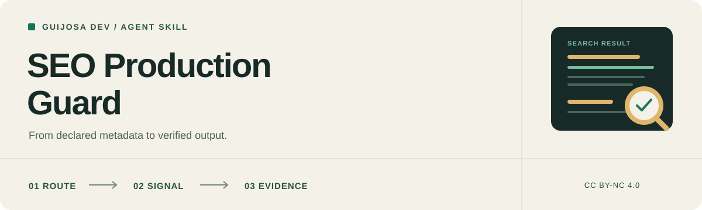

<p align="center">
  
</p>

<h1 align="center">SEO Production Guard</h1>

<p align="center">
  <a href="CHANGELOG.md"></a>
  <a href="LICENSE"></a>
  <a href="CONTRIBUTING.md"></a>
  <a href="tests/skill.test.mjs"></a>
</p>

<p align="center"><a href="README.md" lang="es">Español</a> | <strong>English</strong></p>

<p align="center">
  Instructions for an agent to implement verifiable technical SEO,<br>
  preserve the site's actual policy and show what works.
</p>

<p align="center">
  <strong>Astro | Next.js App Router | Vercel | Cloudflare Workers</strong><br>
  Self-contained skill | On-demand references | CC BY-NC 4.0
</p>

<p align="center">
  <a href="#why-it-exists">Why it exists</a> |
  <a href="#what-it-reviews">What it reviews</a> |
  <a href="#installation">Installation</a> |
  <a href="#usage">Usage</a> |
  <a href="#architecture">Architecture</a> |
  <a href="#contributing">Contributing</a> |
  <a href="#license">License</a>
</p>

---

> [!IMPORTANT]
> **Read the [complete skill](seo-production-guard/SKILL.md) before installing it.** It guides an agent operating with your environment's tools and permissions. It does not create rankings by itself or guarantee indexing, rich results or social previews.

## Why it exists

A present tag may point to the wrong domain. A canonical set in a layout may be inherited by every page. A `noindex` blocked by `robots.txt` may remain invisible to the crawler. Valid JSON-LD may describe information that the page never shows.

SEO Production Guard turns these common failures into reusable decisions and checks. It makes the agent work with actual routes, content, assets and versions, separates auditing from implementation and distinguishes local evidence from production.

Its scope is technical SEO for **Astro** and **Next.js App Router**. It does not replace keyword research, editorial strategy, content creation, digital PR or a general security audit.

## What it reviews

| Area | Questions applied to the code |
| --- | --- |
| **Domain and canonical** | Is the origin stable? Are preview and production separate? Does each route point to its real preferred version? |
| **Open Graph and Twitter** | Is the image public and consistent with its declared URL, MIME type, dimensions and alt? |
| **Per-route metadata** | Do title, description, canonical and `og:url` belong to the current page or were they inherited from home? |
| **Robots and noindex** | Are crawl control, index exclusion and access control treated separately? |
| **Sitemaps** | Does it contain only canonical indexable URLs and verifiable modification dates? |
| **Hreflang** | Do alternates exist, represent equivalent content and link back? |
| **JSON-LD** | Does it describe visible content, connect true entities and prevent script termination when serialized? |
| **Indexing support** | Are Search Console, Bing and `llms.txt` described within their actual limits? |
| **Evidence** | Did the agent inspect emitted HTML, headers and assets or only source code? |

Checks follow the requested scope. Fixing a social image does not automatically require rebuilding robots, JSON-LD and languages.

## How it works

1. **Defines the task.** Audit, implementation, preview diagnosis or indexing.
2. **Reads the environment.** Framework, version, adapter, rendering, domain, routes and published languages.
3. **Traces the signal.** Content, metadata, layout, canonical, asset and final response.
4. **Corrects without inventing.** Existing branding, slugs, policies and deliberate restrictions remain authoritative.
5. **Verifies output.** Home, an interior route and relevant exceptions are checked against actual HTML and assets.
6. **Reports evidence.** Local results, production checks and pending work remain separate.

## Installation

### Skills CLI

Run inside your project:

```bash
npx skills add elpeakyblinder/seo-skill --skill seo-production-guard
```

With pnpm:

```bash
pnpm dlx skills add elpeakyblinder/seo-skill --skill seo-production-guard
```

When supported by your CLI version, select an agent with `--agent codex`, `--agent claude-code`, `--agent antigravity` or `--agent cursor`.

Remote installation retrieves the version already published on GitHub. Local changes are unavailable until pushed.

### Manual installation

Copy the entire **`seo-production-guard/` directory**, including `SKILL.md`, `LICENSE` and `references/`, into your agent's supported skills directory. Do not copy `SKILL.md` alone.

| Agent | Example project destination |
| --- | --- |
| Codex | `.agents/skills/seo-production-guard/` |
| Claude Code | `.claude/skills/seo-production-guard/` |
| Google Antigravity | `.agents/skills/seo-production-guard/` |
| Cursor | `.cursor/skills/seo-production-guard/` |

The package requires no sibling files, author-machine paths, MCP server or dedicated Node package.

## Usage

### Audit without edits

```text
Use seo-production-guard to audit public pages.
Do not modify files. Prioritize findings with evidence and separate
local observations from checks that require production access.
```

### Correct route metadata

```text
Use seo-production-guard to fix canonical, Open Graph and Twitter
metadata on product pages. Preserve the existing URL policy, adapt
templates to real content and run relevant tests.
```

### Diagnose a broken preview

```text
Use seo-production-guard to investigate why this URL has no banner
when shared. Trace page metadata, asset, redirects, WAF and cache.
Correct only the demonstrated cause.
```

Installing the skill does not grant additional permissions or authorize deployments, DNS changes, console submissions or asset generation outside the requested task.

## Architecture

```text
seo-production-guard/
|-- SKILL.md
|-- LICENSE
`-- references/
    |-- astro-seo-guide.md
    |-- nextjs-seo-guide.md
    |-- open-graph-banners.md
    |-- structured-data-jsonld.md
    `-- indexing-sitemaps-llms.md
```

[`SKILL.md`](seo-production-guard/SKILL.md) contains shared decisions and completion criteria. References load only when the task needs that component:

- [Astro](seo-production-guard/references/astro-seo-guide.md)
- [Next.js](seo-production-guard/references/nextjs-seo-guide.md)
- [Open Graph](seo-production-guard/references/open-graph-banners.md)
- [JSON-LD](seo-production-guard/references/structured-data-jsonld.md)
- [Indexing](seo-production-guard/references/indexing-sitemaps-llms.md)

Templates identify integration points and require the target project's actual routes, content sources and assets.

## Validation

The repository includes maintenance tests for packaging, links, versions and functions extracted from the guides:

```bash
node --test tests/skill.test.mjs
```

The current revision has **10 passing tests on Node.js 24**. They do not replace an Astro or Next.js build when an integration changes.

The [Astro](examples/caso-estudio-portafolio-astro.md) and [Next.js](examples/caso-estudio-nextjs-cloudflare.md) cases explain the original context behind several rules. They are background material, not current production certification.

<a id="contributing"></a>
## Contributing and sensitive reports

Corrections, reproducible cases, references and documentation are welcome in Spanish or English. Read [CONTRIBUTING.md](CONTRIBUTING.md) and use the [issue templates](https://github.com/elpeakyblinder/seo-skill/issues/new/choose).

If a report contains credentials, private data, an exploitable route or information about a real system, follow [SECURITY.md](SECURITY.md) and do not publish details. The maintainer process is documented in [PUBLICAR.md](PUBLICAR.md).

## Versions

The current version is **0.1.0**. See [CHANGELOG.md](CHANGELOG.md) and [GitHub releases](https://github.com/elpeakyblinder/seo-skill/releases). The number identifies content and is not an SEO certification.

## License

(c) 2026 Guijosa Dev. Content is distributed under [CC BY-NC 4.0](https://creativecommons.org/licenses/by-nc/4.0/); see [LICENSE](LICENSE). Retain attribution and indicate changes as required.

Commercial use requires separate permission: [devcharlying@gmail.com](mailto:devcharlying@gmail.com).

## Disclaimer

This skill is guidance for AI agents. Models may misread instructions, omit checks or produce unsuitable changes. Review their output and constrain permissions for the environment.

It does not guarantee rankings, traffic, indexing, previews, future compatibility or error-free results. It is not an SEO, security or legal audit, certification or professional advice.
