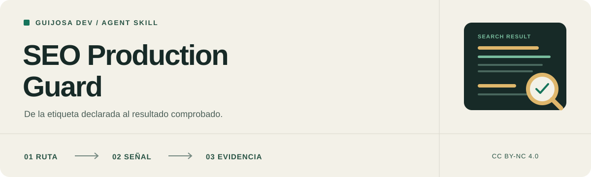

<p align="center">
  
</p>

<h1 align="center">SEO Production Guard</h1>

<p align="center">
  <a href="CHANGELOG.md"></a>
  <a href="LICENSE"></a>
  <a href="CONTRIBUTING.md"></a>
  <a href="tests/skill.test.mjs"></a>
</p>

<p align="center"><strong>Español</strong> | <a href="README.en.md" lang="en">English</a></p>

<p align="center">
  Instrucciones para que un agente implemente SEO técnico comprobable,<br>
  conserve la política real del sitio y demuestre qué funciona.
</p>

<p align="center">
  <strong>Astro | Next.js App Router | Vercel | Cloudflare Workers</strong><br>
  Skill autocontenida | Referencias bajo demanda | CC BY-NC 4.0
</p>

<p align="center">
  <a href="#por-qué-existe">Por qué existe</a> |
  <a href="#qué-revisa">Qué revisa</a> |
  <a href="#instalación">Instalación</a> |
  <a href="#cómo-usarla">Uso</a> |
  <a href="#arquitectura">Arquitectura</a> |
  <a href="#contribuir">Contribuir</a> |
  <a href="#licencia">Licencia</a>
</p>

---

> [!IMPORTANT]
> **Lee [la skill completa](seo-production-guard/SKILL.md) antes de instalarla.** Orienta a un agente que trabaja con los permisos y herramientas de tu entorno. No añade posicionamiento por sí sola ni garantiza ranking, indexación, rich results o previews sociales.

## Por qué existe

Una etiqueta presente puede apuntar al dominio equivocado. Un canonical definido en el layout puede heredarse en todas las páginas. Un `noindex` bloqueado por `robots.txt` puede quedar invisible para el crawler. Un JSON-LD válido puede describir información que la página nunca muestra.

SEO Production Guard convierte esos fallos frecuentes en decisiones y comprobaciones reutilizables. La skill obliga al agente a trabajar con rutas, contenido, activos y versiones reales; separa auditoría de implementación y distingue evidencia local de producción.

Su alcance es SEO técnico en **Astro** y **Next.js App Router**. No sustituye investigación de palabras clave, estrategia editorial, creación de contenido, relaciones públicas digitales o una auditoría general de seguridad.

## Qué revisa

| Área | Preguntas que lleva al código |
| --- | --- |
| **Dominio y canonical** | ¿El origen es estable? ¿Preview y producción están separados? ¿Cada ruta apunta a su versión preferida real? |
| **Open Graph y Twitter** | ¿La imagen existe, es pública y coincide con URL, MIME, dimensiones y alt declarados? |
| **Metadatos por ruta** | ¿Título, descripción, canonical y `og:url` pertenecen a la página actual o fueron heredados del inicio? |
| **Robots y noindex** | ¿Se distingue control de rastreo, exclusión del índice y control de acceso? |
| **Sitemaps** | ¿Solo contiene URLs canónicas indexables y fechas de modificación verificables? |
| **Hreflang** | ¿Los alternates existen, son equivalentes y se enlazan recíprocamente? |
| **JSON-LD** | ¿Describe contenido visible, conecta entidades verdaderas y se serializa sin permitir cierre de script? |
| **Indexación asistida** | ¿Search Console, Bing y `llms.txt` se presentan con sus límites reales, sin promesas? |
| **Evidencia** | ¿El agente inspeccionó HTML, encabezados y recursos emitidos o solo leyó el código fuente? |

Las comprobaciones se aplican según el alcance. Arreglar una imagen social no exige rehacer automáticamente robots, JSON-LD e idiomas.

## Cómo trabaja

1. **Delimita la tarea.** Distingue auditoría, implementación, diagnóstico de previews o indexación.
2. **Reconoce el entorno.** Comprueba framework, versión, adaptador, renderizado, dominio, rutas e idiomas publicados.
3. **Traza la señal.** Sigue contenido, metadata, layout, canonical, recurso y respuesta final.
4. **Corrige sin inventar.** Conserva branding, slugs, políticas y restricciones existentes cuando son deliberadas.
5. **Verifica resultados.** Contrasta página principal, ruta interior y excepciones relevantes con HTML y recursos reales.
6. **Entrega evidencia.** Separa lo probado localmente, lo comprobado en producción y lo que sigue pendiente.

## Instalación

### Con el CLI de Skills

Ejecuta en la carpeta del proyecto:

```bash
npx skills add elpeakyblinder/seo-skill --skill seo-production-guard
```

Con pnpm:

```bash
pnpm dlx skills add elpeakyblinder/seo-skill --skill seo-production-guard
```

Para elegir un agente añade, cuando tu versión del CLI lo admita, `--agent codex`, `--agent claude-code`, `--agent antigravity` o `--agent cursor`.

La instalación remota obtiene la versión ya publicada en GitHub. Los cambios locales no aparecen hasta hacer push.

### Instalación manual

Copia la carpeta **`seo-production-guard/` completa**, con `SKILL.md`, `LICENSE` y `references/`, en el directorio de skills admitido por tu agente. No copies únicamente `SKILL.md`.

| Agente | Ejemplo de destino dentro del proyecto |
| --- | --- |
| Codex | `.agents/skills/seo-production-guard/` |
| Claude Code | `.claude/skills/seo-production-guard/` |
| Google Antigravity | `.agents/skills/seo-production-guard/` |
| Cursor | `.cursor/skills/seo-production-guard/` |

El paquete no depende de archivos hermanos, rutas de la computadora del autor, un servidor MCP o un paquete propio de Node.

## Cómo usarla

### Auditar sin modificar

```text
Usa seo-production-guard para auditar las páginas públicas.
No modifiques archivos. Prioriza hallazgos con evidencia y distingue
lo comprobado en local de lo que requiere acceso a producción.
```

### Corregir metadatos por ruta

```text
Usa seo-production-guard para corregir canonical, Open Graph y Twitter
en las páginas de producto. Conserva la política de URLs existente,
adapta las plantillas al contenido real y ejecuta las pruebas relevantes.
```

### Diagnosticar una preview rota

```text
Usa seo-production-guard para investigar por qué esta URL no muestra
su banner al compartirla. Sigue página, metadatos, recurso, redirects,
WAF y caché. Corrige únicamente la causa comprobada.
```

Instalar la skill no concede permisos adicionales ni autoriza despliegues, cambios DNS, envíos a consolas o generación de activos fuera de la tarea solicitada.

## Arquitectura

```text
seo-production-guard/
|-- SKILL.md
|-- LICENSE
`-- references/
    |-- astro-seo-guide.md
    |-- nextjs-seo-guide.md
    |-- open-graph-banners.md
    |-- structured-data-jsonld.md
    `-- indexing-sitemaps-llms.md
```

[`SKILL.md`](seo-production-guard/SKILL.md) contiene las decisiones compartidas y el criterio de cierre. Las referencias se cargan únicamente cuando la tarea necesita ese componente:

- [Astro](seo-production-guard/references/astro-seo-guide.md)
- [Next.js](seo-production-guard/references/nextjs-seo-guide.md)
- [Open Graph](seo-production-guard/references/open-graph-banners.md)
- [JSON-LD](seo-production-guard/references/structured-data-jsonld.md)
- [Indexación](seo-production-guard/references/indexing-sitemaps-llms.md)

Las plantillas señalan puntos de integración; necesitan las rutas, fuentes de contenido y activos del proyecto donde se apliquen.

## Validación

El repositorio incluye pruebas de mantenimiento para el paquete, enlaces, versiones y funciones extraídas de las guías:

```bash
node --test tests/skill.test.mjs
```

La revisión actual contiene **10 pruebas aprobadas con Node.js 24**. Estas pruebas no sustituyen un build de Astro o Next.js cuando cambia una integración.

Los [casos de Astro](examples/caso-estudio-portafolio-astro.md) y [Next.js](examples/caso-estudio-nextjs-cloudflare.md) explican el contexto que originó varias reglas. Se presentan como antecedentes, no como certificación actual de producción.

<a id="contribuir"></a>
## Contribuir y reportar problemas

Se aceptan correcciones, casos reproducibles, referencias y documentación en español o inglés. Lee [CONTRIBUTING.md](CONTRIBUTING.md) y utiliza las [plantillas de issues](https://github.com/elpeakyblinder/seo-skill/issues/new/choose).

Si un reporte contiene credenciales, datos privados, una ruta explotable o información de un sistema real, sigue [SECURITY.md](SECURITY.md) y no publiques los detalles. El proceso del mantenedor está en [PUBLICAR.md](PUBLICAR.md).

## Versiones

La versión actual es **0.1.0**. Consulta [CHANGELOG.md](CHANGELOG.md) y las [releases](https://github.com/elpeakyblinder/seo-skill/releases). El número identifica el contenido; no funciona como certificación SEO.

## Licencia

(c) 2026 Guijosa Dev. El contenido se distribuye bajo [CC BY-NC 4.0](https://creativecommons.org/licenses/by-nc/4.0/deed.es); consulta [LICENSE](LICENSE). Conserva atribución e indica las modificaciones según sus términos.

Los usos comerciales requieren permiso separado: [devcharlying@gmail.com](mailto:devcharlying@gmail.com).

## Aviso de responsabilidad

La skill es material orientativo para agentes de IA. Los modelos pueden interpretar mal instrucciones, omitir comprobaciones o producir cambios inadecuados. Revisa los resultados y limita sus permisos según el entorno.

No garantiza posicionamiento, tráfico, indexación, previews, compatibilidad futura ni ausencia de errores. No constituye una auditoría, certificación o asesoría profesional de SEO, seguridad o derecho.
